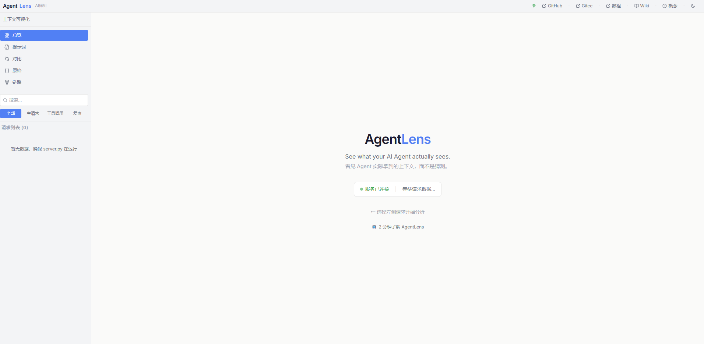

# AgentLens

**See what your AI Agent actually sees.**

AI Agent 的 DevTools — 拦截请求，可视化上下文，看见 Prompt 里到底有什么。

## 功能截图


## 它能帮你做什么

- **CLAUDE.md / Rules 到底生效了没？** — System Prompt 区一目了然
- **上下文为什么被撑爆了？** — 每个部分占了多少 Token，可视化分布
- **Skill / Memory / MCP 工具注入了什么？** — 逐项拆解，完整展开
- **两次请求间变了什么？** — Diff 对比，类似 Git
- **原始请求/响应数据** — JSON 树形浏览，搜索高亮

---

## 快速开始

### 方式一：下载压缩包（推荐）

1. 前往 [Releases](https://github.com/along-along/agent-lens/releases) 下载最新 `agentlens-v1.0-portable.zip`
2. 解压到任意目录
3. 双击 `start.bat`（Windows）或运行 `./start.sh`（Mac/Linux）
4. 首次启动会自动安装 Python 依赖

### 方式二：源码运行

```bash
# 克隆仓库
git clone https://github.com/along-along/agent-lens.git
# 或 Gitee: git clone https://gitee.com/along-ai/agent-lens.git
cd agent-lens

# 安装 Python 依赖
pip install -r requirements.txt

# 启动
start.bat          # Windows
./start.sh         # Mac/Linux
```

### 启动后

```bash
# 配置你的 AI Agent 走代理
set ANTHROPIC_BASE_URL=http://localhost:8899     # Windows
export ANTHROPIC_BASE_URL=http://localhost:8899   # Mac/Linux

# 正常使用 Agent（Claude Code / Cline / Cursor...）
claude

# 打开浏览器查看
http://localhost:8900
```

就这样。请求会自动被记录和分析。

> **前端开发者注意**：修改前端源码后需要重新构建 `cd frontend && npm install && npm run build`

---

## 工作原理

```
你的 AI Agent (Claude Code / Cline / Cursor)
    ↓ 请求
AgentLens Proxy (localhost:8899) — 拦截 & 记录
    ↓ 透明转发
目标 API (DeepSeek / Anthropic / OpenAI...)

AgentLens Web UI (localhost:8900) — 可视化分析
```

---

## 页面说明

| 页面 | 功能 |
|------|------|
| 总览 | 上下文加载状态 + Token 分布 + 警告 |
| 提示词 | System Prompt / Messages / Tools 完整拆解 |
| 对比 | 两次请求间的上下文 Diff |
| 原始 | JSON 树形浏览 + 搜索高亮 |
| 链路 | 执行流程可视化（用户→思考→工具→回复）|

<!-- TODO: 各页面截图 -->

---

## 配置

| 环境变量 | 默认值 | 说明 |
|---------|--------|------|
| `PROXY_PORT` | 8899 | 代理端口 |
| `PROXY_TARGET` | `https://api.deepseek.com/anthropic` | 转发目标 |
| `VIEWER_PORT` | 8900 | Web UI 端口 |

---

## 项目结构

```
├── server.py          # Web UI 服务
├── proxy.py           # 代理拦截
├── frontend/          # 前端源码 (React + Vite + TailwindCSS)
├── static/            # 前端构建产物
├── data/              # 请求记录 (JSONL)
├── scripts/           # 打包脚本
├── start.bat          # Windows 一键启动
└── start.sh           # Linux/Mac 一键启动
```

---

## 开发 & 打包

```bash
# 前端开发（热更新）
cd frontend
npm install
npm run dev

# 前端构建（生成 static/ 供 server.py 使用）
cd frontend
npm run build

# 打包分发包（生成 dist/agentlens-v1.0-portable.zip）
scripts/build.bat      # Windows
./scripts/build.sh     # Mac/Linux
```

---

## 相关资源

<!-- TODO: 填写B站视频URL -->
- 📺 **视频教程**: [B站]()
- 📖 **知识库**: [飞书文档](https://my.feishu.cn/wiki/FlL6wIZVnioDQXkmStGcU9vwnge?fromScene=spaceOverview)
- ⭐ **GitHub**: [github.com/along-along/agent-lens](https://github.com/along-along/agent-lens)
- ⭐ **Gitee**: [gitee.com/along-ai/agent-lens](https://gitee.com/along-ai/agent-lens)
<!-- TODO: 飞书群二维码 -->

---

## License

MIT
